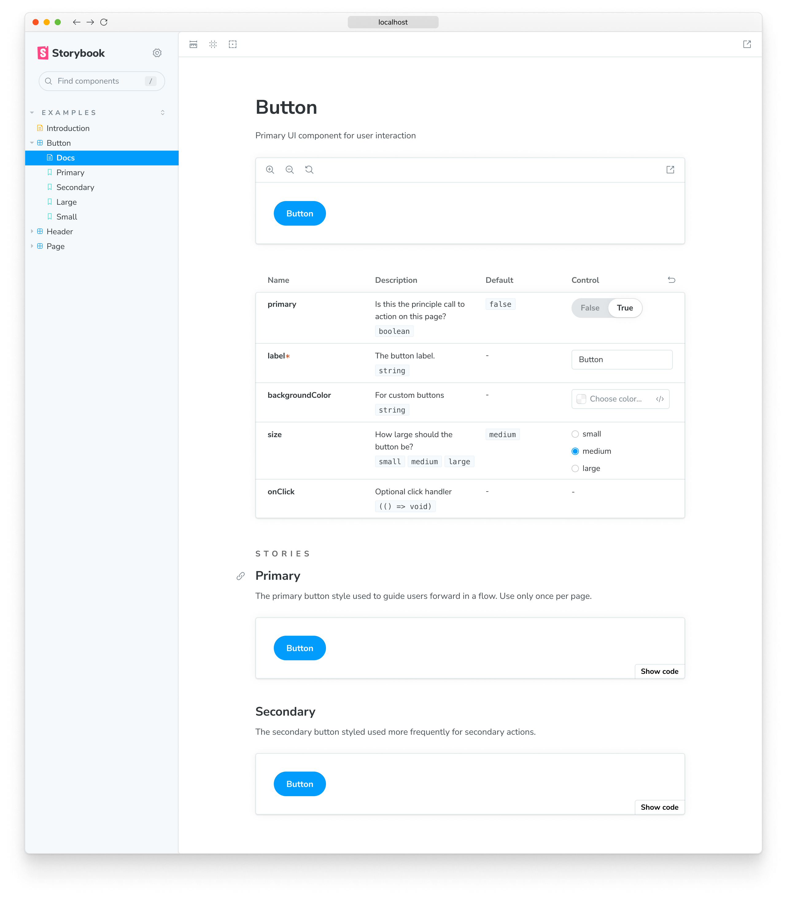
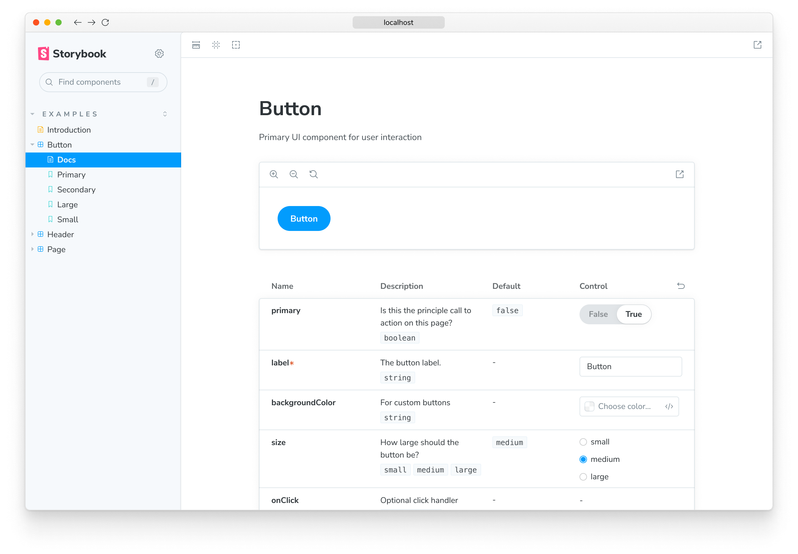
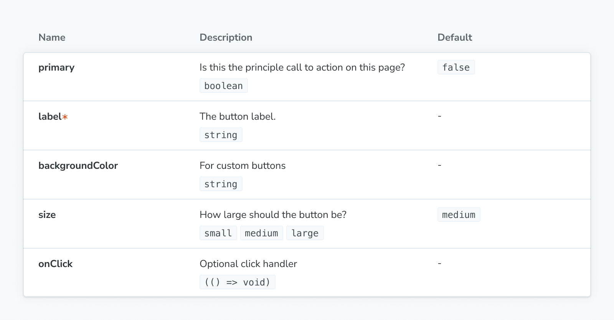
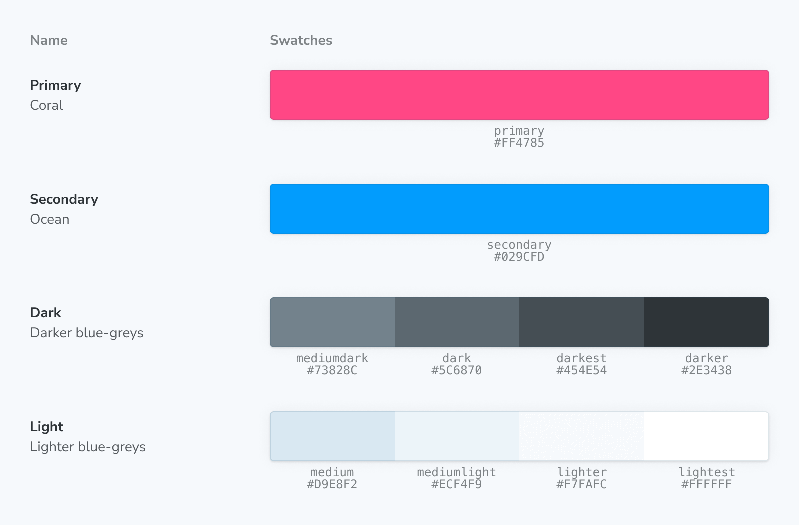
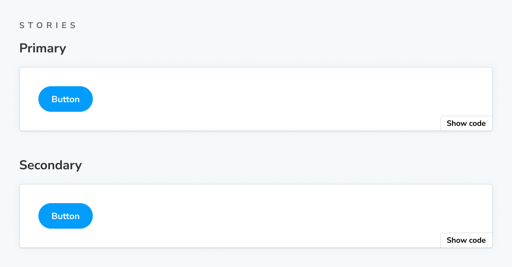

<YouTubeCallout id="uAA1JvLcl-w" title="Avoid Documentation Nightmares with Storybook Doc Blocks" />

Storybook offers several doc blocks to help document your components and other aspects of your project.

There are two common ways to use doc blocks in Storybook, within MDX and as part of the docs page template.

## Within MDX

The blocks are most commonly used within Storybook's [MDX documentation](./mdx.md):



<!-- prettier-ignore-start -->
```md
{/* ButtonDocs.mdx */}

import { Meta, Primary, Controls, Story } from '@storybook/blocks';
import * as ButtonStories from './Button.stories';

<Meta of={ButtonStories} />

# Button

A button is ...

<Primary />

## Props

<Controls />

## Stories

### Primary

A button can be of primary importance.

<Story of={ButtonStories.Primary} />

A button can be of secondary importance.

<Story of={ButtonStories.Secondary} />

{/* ... */}
```
<!-- prettier-ignore-end -->

## Customizing the automatic docs page

The blocks are also used to define the page template for [automatics docs](./autodocs.md). For example, here's the default template:



```jsx
import { Title, Subtitle, Description, Primary, Controls, Stories } from '@storybook/blocks';

export const autoDocsTemplate = () => (
  <>
    <Title />
    <Subtitle />
    <Description />
    <Primary />
    <Controls />
    <Stories />
  </>
);
```

If you [override the default page template](./autodocs.md#write-a-custom-template), you can similarly use Doc Blocks to build the perfect documentation page for your project.

Note that some doc blocks render other blocks. For example, the `<Stories />` block expands to:

<!-- prettier-ignore-start -->
```md
## Stories

<Canvas>
  ### Story name
  <Description />
  <Story />
  <Source />
</Canvas>

{/* ... repeat <Canvas> for each story */}
```
<!-- prettier-ignore-end -->

As a result, for example, customizing the [`Source`](../10-api/doc-block-source.md) block via parameters (see next section) will also affect the Source blocks rendered as part of [`Canvas`](../10-api/doc-block-canvas.md) blocks.

## Customizing doc blocks

In both use cases (MDX and automatic docs), many of the doc blocks can be customized via [parameters](../02-writing-stories/parameters.md).

For example, you can filter out the `style` prop from all [`Controls`](../10-api/doc-block-controls.md) tables through your Storybook:

<!-- prettier-ignore-start -->
<CodeSnippets
  paths={[
    'common/storybook-preview-doc-blocks-controls-exclude-prop.js.mdx',
    'common/storybook-preview-doc-blocks-controls-exclude-prop.ts.mdx',
  ]}
/>

<!-- prettier-ignore-end -->

<Callout variant="info">

Parameters can also be defined at the [component](../02-writing-stories/parameters.md#component-parameters) (or meta) level or the [story](../02-writing-stories/parameters.md#story-parameters) level, allowing you to customize Doc Blocks exactly as you need, where you need.

</Callout>

The blocks that accept customization via parameters are marked in the list of available blocks below.

When using a doc block in MDX, it can also be customized with its props:

<!-- prettier-ignore-start -->
```md
<Controls exclude={['style']}>
```
<!-- prettier-ignore-end -->

## Available blocks

Each block has a dedicated API reference page detailing usage, available options, and technical details.

### [ArgTypes](../10-api/doc-block-argtypes.md)

<Callout variant="info">

Accepts parameters in the namespace `parameters.docs.argTypes`.

</Callout>

The `ArgTypes` block can be used to show a static table of [arg types](../10-api/arg-types.md) for a given component as a way to document its interface.



### [Canvas](../10-api/doc-block-canvas.md)

<Callout variant="info">

Accepts parameters in the namespace `parameters.docs.canvas`.

</Callout>

The `Canvas` block is a wrapper around a [`Story`](../10-api/doc-block-story.md), featuring a toolbar that allows you to interact with its content while automatically providing the required [`Source`](../10-api/doc-block-source.md) snippets.


### [ColorPalette](../10-api/doc-block-colorpalette.md)

The `ColorPalette` block allows you to document all color-related items (e.g., swatches) used throughout your project.



### [Controls](../10-api/doc-block-controls.md)

<Callout variant="info">

Accepts parameters in the namespace `parameters.docs.controls`.

</Callout>

The `Controls` block can be used to show a dynamic table of args for a given story, as a way to document its interface, and to allow you to change the args for a (separately) rendered story (via the [`Story`](../10-api/doc-block-story.md) or [`Canvas`](../10-api/doc-block-canvas.md) blocks).


### [Description](../10-api/doc-block-description.md)

The `Description` block displays the description for a component, story, or meta obtained from their respective JSDoc comments.


### [IconGallery](../10-api/doc-block-icongallery.md)

The `IconGallery` block lets you quickly document all icons associated with your project, displayed in a neat grid.


### [Markdown](../10-api/doc-block-markdown.md)

The `Markdown` block allows you to import and include plain markdown in your MDX files.


### [Meta](../10-api/doc-block-meta.md)

The `Meta` block is used to [attach](#attached-vs-unattached) a custom MDX docs page alongside a component’s list of stories. It doesn’t render any content but serves two purposes in an MDX file:

- Attaches the MDX file to a component and its stories, or
- Controls the location of the unattached docs entry in the sidebar.

### [Primary](../10-api/doc-block-primary.md)

The `Primary` block displays the primary (first defined in the stories file) story in a [`Story`](../10-api/doc-block-story.md) block. It is typically rendered immediately under the title in a docs entry.


### [Source](../10-api/doc-block-source.md)

<Callout variant="info">

Accepts parameters in the namespace `parameters.docs.source`.

</Callout>

The `Source` block is used to render a snippet of source code directly.


### [Stories](../10-api/doc-block-stories.md)

The `Stories` block renders the full collection of stories in a stories file.



### [Story](../10-api/doc-block-story.md)

<Callout variant="info">

Accepts parameters in the namespace `parameters.docs.story`.

</Callout>

Stories (component tests) are Storybook's fundamental building blocks.

In Storybook Docs, you can render any of your stories from your CSF files in the context of an MDX file with all annotations (parameters, args, loaders, decorators, play function) applied using the `Story` block.


### [Subtitle](../10-api/doc-block-subtitle.md)

The `Subtitle` block can serve as a secondary heading for your docs entry.


### [Title](../10-api/doc-block-title.md)

The `Title` block serves as the primary heading for your docs entry. It is typically used to provide the component or page name.


### [Typeset](../10-api/doc-block-typeset.md)

The `Typeset` block helps document the fonts used throughout your project.


### [Unstyled](../10-api/doc-block-unstyled.md)

The `Unstyled` block is a unique block that disables Storybook's default styling in MDX docs wherever it is added.

By default, most elements (like `h1`, `p`, etc.) in docs have a few default styles applied to ensure the docs look good. However, sometimes you might want some of your content not to have these styles applied. In those cases, wrap the content with the `Unstyled` block to remove the default styles.


## Make your own Doc Blocks

Storybook also provides a [`useOf` hook](../10-api/doc-block-useof.md) to make it easier to create your own blocks that function like the built-in blocks.

## Troubleshooting

### Why can't I use the Doc Blocks inside my stories?

Storybook's Doc Blocks are highly customizable and helpful building blocks to assist you with building your custom documentation. Although most of them enable you to customize them with parameters or globally to create custom [documentation templates](#customizing-the-automatic-docs-page), they are primarily designed for MDX files. For example, if you try to add the `ColorPalette` block to your stories as follows, you'll get an error message when the story loads in Storybook.

<!-- prettier-ignore-start -->
<CodeSnippets
  paths={[
    'common/storybook-canvas-doc-block-story.js.mdx',
    'common/storybook-canvas-doc-block-story.ts.mdx',
  ]}
/>

<!-- prettier-ignore-end -->

#### Learn more about Storybook documentation

- [Autodocs](./autodocs.md) for creating documentation for your stories
- [MDX](./mdx.md) for customizing your documentation
- Doc Blocks for authoring your documentation
- [Publishing docs](./build-documentation.md) to automate the process of publishing your documentation
