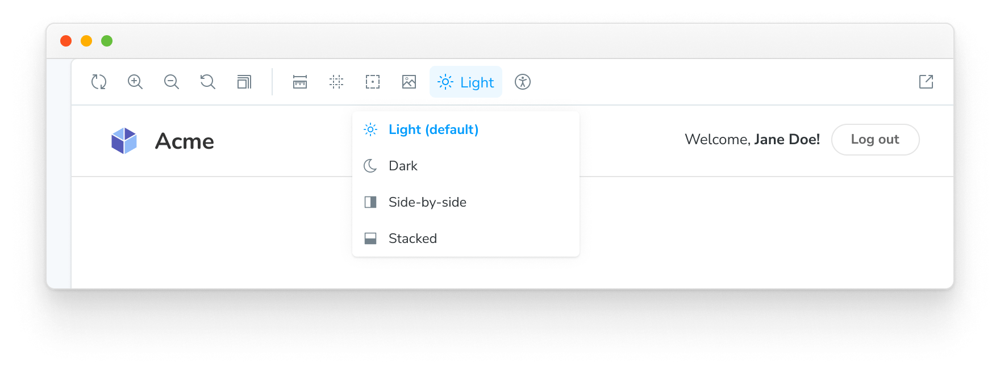

<YouTubeCallout id="DuJ_gmSncLM" title="Create custom toolbar items using global types" />

Storybook ships with toolbar addons to control the [viewport](./viewport.md) and [background](./backgrounds.md) the story renders in. You can also create your own toolbar items which control special “globals” which you can then read to create [decorators](../02-writing-stories/decorators.md) to control story rendering.

## Globals

Globals in Storybook represents “global” (as in not story-specific) inputs to the rendering of the story. As they aren’t specific to the story, they aren’t passed in the `args` argument to the story function (although they are accessible as `context.globals`), but typically you use them in decorators, which apply to all stories.

When the globals change, the story re-renders, and the decorators rerun with the new values. The easiest way to change globals is to create a toolbar item for them.

## Global types and the toolbar annotation

Storybook has a simple, declarative syntax for configuring toolbar menus. In your [`.storybook/preview.js|ts`](../08-configure/index.md#configure-story-rendering), you can add your own toolbars by creating `globalTypes` with a `toolbar` annotation:

<!-- prettier-ignore-start -->

<CodeSnippets
  paths={[
    'common/storybook-preview-configure-globaltypes.js.mdx',
    'common/storybook-preview-configure-globaltypes.ts.mdx',
  ]}
/>

<!-- prettier-ignore-end -->

<Callout variant="info" icon="💡">

As globals are _global_ you can _only_ set `globalTypes` in [`.storybook/preview.js|ts`](../08-configure/index.md#configure-story-rendering).

</Callout>

When you start your Storybook, you should see a new dropdown with the `light` and `dark` options in your toolbar.

## Create a decorator

We have a `global` implemented. Let's wire it up! We can consume our new `theme` global in a decorator using the `context.globals.theme` value.

<IfRenderer renderer='react'>

For example, suppose you are using [`styled-components`](https://styled-components.com/). You can add a theme provider decorator to your [`.storybook/preview.js|ts`](../08-configure/index.md#configure-story-rendering) config:

<!-- prettier-ignore-start -->

<CodeSnippets
  paths={[
    'react/storybook-preview-use-global-type.js.mdx',
    'react/storybook-preview-use-global-type.ts.mdx',
  ]}
/>

<!-- prettier-ignore-end -->

</IfRenderer>

<IfRenderer renderer='vue'>

For example, suppose you are using [`Vuetify`](https://vuetifyjs.com/en/). You can add a theme provider decorator to your [`.storybook/preview.js|ts`](../08-configure/index.md#configure-story-rendering) config:

<!-- prettier-ignore-start -->

<CodeSnippets
  paths={[
    'vue/storybook-preview-use-global-type.3.js.mdx',
    'vue/storybook-preview-use-global-type.3.ts.mdx',
  ]}
/>

<!-- prettier-ignore-end -->

</IfRenderer>

<IfRenderer renderer='angular'>

For example, suppose you are using [`Angular Material`](https://material.angular.io/). You can add a theme provider decorator to your [`.storybook/preview.js|ts`](../08-configure/index.md#configure-story-rendering) config:

<!-- prettier-ignore-start -->

<CodeSnippets
  paths={[
    'angular/storybook-preview-use-global-type.ts.mdx',
  ]}
/>

<!-- prettier-ignore-end -->

</IfRenderer>

<IfRenderer renderer={['ember', 'html', 'preact', 'qwik', 'svelte', 'solid', 'web-components' ]}>

Depending on your framework and theming library, you can extend your [`.storybook/preview.js|ts`](../08-configure/index.md#configure-story-rendering) and provide a decorator to load the theme. For example:

<!-- prettier-ignore-start -->

<CodeSnippets
  paths={[
    'common/storybook-preview-use-global-type.js.mdx',
    'common/storybook-preview-use-global-type.ts.mdx',
  ]}
/>

<!-- prettier-ignore-end -->

</IfRenderer>

## Advanced usage

So far, we've managed to create and consume a global inside Storybook.

Now let's take a look at a more complex example. Let's suppose we wanted to implement a new global called **locale** for internationalization, which shows a flag on the right side of the toolbar.

In your [`.storybook/preview.js|ts`](../08-configure/index.md#configure-story-rendering), add the following:

<!-- prettier-ignore-start -->

<CodeSnippets
  paths={[
    'common/storybook-preview-locales-globaltype.js.mdx',
    'common/storybook-preview-locales-globaltype.ts.mdx',
  ]}
/>

<!-- prettier-ignore-end -->

<Callout variant="info" icon="💡" style={{ marginBottom: '10px' }}>

The `icon` element used in the examples loads the icons from the `@storybook/components` package. See [here](../12-faq.md#what-icons-are-available-for-my-toolbar-or-my-addon) for the list of available icons that you can use.

</Callout>

<Callout variant="info" icon="💡">

The `@storybook/addon-toolbars` addon is required to use toolbars. The toolbars addon is included by default in
`@storybook/addon-essentials`.

</Callout>

By adding the configuration element `right`, the text will be displayed on the right side in the toolbar menu once you connect it to a decorator.

Here's a list of the configuration options available.

| MenuItem  |  Type  |                           Description                           | Required |
| --------- | :----: | :-------------------------------------------------------------: | :------: |
| **value** | String |    The string value of the menu that gets set in the globals    |   Yes    |
| **title** | String |                   The main text of the title                    |   Yes    |
| **left**  | String |      A string that gets shown on the left side of the menu      |    No    |
| **right** | String |   A string that gets displayed on the right side of the menu    |    No    |
| **icon**  | String | An icon that gets shown in the toolbar if this item is selected |    No    |

## Consuming globals from within a story

We recommend consuming globals from within a decorator and define a global setting for all stories.

But we're aware that sometimes it's more beneficial to use toolbar options on a per-story basis.

Using the example above, you can modify any story to retrieve the **Locale** `global` from the story context:

<!-- prettier-ignore-start -->

<CodeSnippets
  paths={[
    'react/my-component-story-use-globaltype.js.mdx',
    'react/my-component-story-use-globaltype.ts.mdx',
    'vue/my-component-story-use-globaltype.js.mdx',
    'vue/my-component-story-use-globaltype.ts.mdx',
    'angular/my-component-story-use-globaltype.ts.mdx',
    'svelte/my-component-story-use-globaltype.js.mdx',
    'svelte/my-component-story-use-globaltype.ts.mdx',
    'web-components/my-component-story-use-globaltype.js.mdx',
    'web-components/my-component-story-use-globaltype.ts.mdx',
    'solid/my-component-story-use-globaltype.js.mdx',
    'solid/my-component-story-use-globaltype.ts.mdx',
  ]}
  usesCsf3
  csf2Path="essentials/toolbars-and-globals#snippet-my-component-story-use-globaltype"
/>

<!-- prettier-ignore-end -->

<Callout variant="info" icon="💡">

In Storybook 6.0, if you set the global option `passArgsFirst: false` for backward compatibility, the story context is passed as the first argument:

<!-- prettier-ignore-start -->

<CodeSnippets
  paths={[
    'react/my-component-story-use-globaltype-backwards-compat.js.mdx',
    'vue/my-component-story-use-globaltype-backwards-compat.js.mdx',
    'angular/my-component-story-use-globaltype-backwards-compat.ts.mdx',
    'svelte/my-component-story-use-globaltype-backwards-compat.js.mdx',
    'svelte/my-component-story-use-globaltype-backwards-compat.ts.mdx',
    'web-components/my-component-story-use-globaltype-backwards-compat.js.mdx',
    'web-components/my-component-story-use-globaltype-backwards-compat.ts.mdx',
    'solid/my-component-story-use-globaltype-backwards-compat.js.mdx',
  ]}
/>

<!-- prettier-ignore-end -->

</Callout>

## Consuming globals from within an addon

If you're working on a Storybook addon and need to retrieve globals, you can do so. The `@storybook/manager-api` package provides a hook for this scenario. You can use the [`useGlobals()`](../07-addons/addons-api.md#useglobals) hook to retrieve any globals you want.

Using the ThemeProvider example above, you could expand it to display which theme is active inside a panel as such:

<!-- prettier-ignore-start -->

<CodeSnippets
  paths={[
    'common/addon-consume-globaltype.js.mdx',
  ]}
/>

<!-- prettier-ignore-end -->

## Updating globals from within an addon

If you're working on a Storybook addon that needs to update the global and refreshes the UI, you can do so. As mentioned previously, the `@storybook/manager-api` package provides the necessary hook for this scenario. You can use the `updateGlobals` function to update any global values you need.

For example, if you were working on a [toolbar addon](../07-addons/addon-types.md#toolbars), and you want to refresh the UI and update the global once the user clicks on a button:

<!-- prettier-ignore-start -->

<CodeSnippets
  paths={[
    'common/addon-consume-and-update-globaltype.js.mdx',
  ]}
/>

<!-- prettier-ignore-end -->
