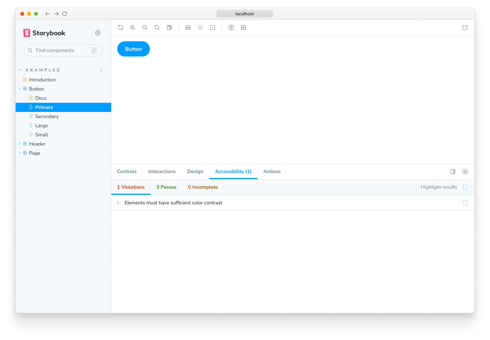

Storybook has [hundreds of reusable addons](https://storybook.js.org/addons) that are packaged as NPM modules. Let's walk through how to extend Storybook by installing and registering addons.

### Using addons

With the exception of preset addons, all addons have the same installation process: install and register.

For example, to include accessibility testing in Storybook, run the following command to install the necessary addon:

<!-- prettier-ignore-start -->

<CodeSnippets
  paths={[
    'common/storybook-a11y-install.yarn.js.mdx',
    'common/storybook-a11y-install.npm.js.mdx',
    'common/storybook-a11y-install.pnpm.js.mdx',
  ]}
/>

<!-- prettier-ignore-end -->

Next, update [`.storybook/main.js|ts`](../08-configure/index.md#configure-story-rendering) to the following:

<!-- prettier-ignore-start -->

<CodeSnippets
  paths={[
    'common/storybook-a11y-register.js.mdx',
    'common/storybook-a11y-register.ts.mdx',
  ]}
/>

<!-- prettier-ignore-end -->

<Callout variant="info">

Addons may also require addon-specific configuration. Read their respective READMEs.

</Callout>

Now when you run Storybook the accessibility testing addon will be enabled.

### Using preset addons

Storybook preset addons are grouped collections of specific `babel`, `webpack` and `addons` configurations for distinct use cases. Each one with its own set of instructions. Preset addons have a three-step installation process: install, register and optionally configuration.

For example, to use SCSS styling, run the following command to install the addon and the required dependencies:

<!-- prettier-ignore-start -->

<CodeSnippets
  paths={[
    'common/storybook-preset-scss.webpack-4.js.mdx',
    'common/storybook-preset-scss.webpack-5.js.mdx',
  ]}
/>

<!-- prettier-ignore-end -->

<Callout variant="info" icon="💡" title="Tip:">

Use the Webpack 5 snippet only if your framework already includes support for this version. Otherwise, use the Webpack 4 snippet.

</Callout>

Next, update [`.storybook/main.js|ts`](../08-configure/index.md#configure-story-rendering) to the following:

<!-- prettier-ignore-start -->

<CodeSnippets
  paths={[
    'common/storybook-main-preset-config.js.mdx',
    'common/storybook-main-preset-config.ts.mdx',
  ]}
/>

<!-- prettier-ignore-end -->

Now when you run Storybook it will configure itself to use SCSS styling. No further configuration is needed.

#### Optional configuration

Most preset addons can also take additional parameters. The most common use cases are:

- Addon configuration
- Webpack loader configuration

Consider the following example:

<!-- prettier-ignore-start -->

<CodeSnippets
  paths={[
    'common/storybook-preset-configuration.js.mdx',
    'common/storybook-preset-configuration.ts.mdx',
  ]}
/>

<!-- prettier-ignore-end -->

<Callout variant="info">

Preset addons may also have addon-specific configurations. Read their respective READMEs.

</Callout>

Now, when Storybook starts up, it will update webpack's CSS loader to use modules and adjust how styling is defined.
