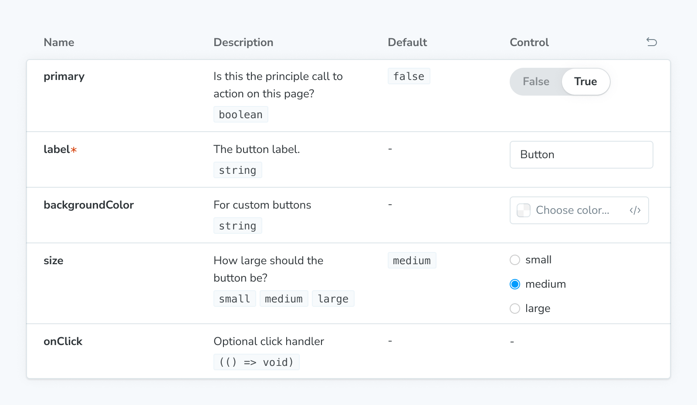

<YouTubeCallout id="uAA1JvLcl-w" title="Avoid Documentation Nightmares with Storybook's Controls Doc Block" params='start=240' />

The `Controls` block can be used to show a dynamic table of args for a given story, as a way to document its interface, and to allow you to change the args for a (separately) rendered story (via the [`Story`](./doc-block-story.md) or [`Canvas`](./doc-block-canvas.md) blocks).

<Callout variant="info" icon="💡">

If you’re looking for a static table that shows a component's arg types with no controls, see the [`ArgTypes`](./doc-block-argtypes.md) block instead.

</Callout>



<!-- prettier-ignore-start -->
```md
{/* ButtonDocs.mdx */}

import { Meta, Canvas, Controls } from '@storybook/blocks';
import * as ButtonStories from './Button.stories'

<Meta of={ButtonStories} />

<Canvas of={ButtonStories.Primary} />

<Controls of={ButtonStories.Primary} />
```
<!-- prettier-ignore-end -->

<Callout variant="warning">

The Controls doc block will only have functioning UI controls if you have also installed and registered [`@storybook/addon-controls`](../06-essentials/controls.md) (included in [`@storybook/addon-essentials`](../06-essentials/index.md)).

</Callout>

## Controls

```js
import { Controls } from '@storybook/blocks';
```

<details>
<summary>Configuring with props <strong>and</strong> parameters</summary>

ℹ️ Like most blocks, the `Controls` block is configured with props in MDX. Many of those props derive their default value from a corresponding [parameter](../02-writing-stories/parameters.md) in the block's namespace, `parameters.docs.controls`.

The following `exclude` configurations are equivalent:

<!-- prettier-ignore-start -->

<CodeSnippets
  paths={[
    'angular/api-doc-block-controls-parameter.ts.mdx',
    'web-components/api-doc-block-controls-parameter.js.mdx',
    'web-components/api-doc-block-controls-parameter.ts.mdx',
    'common/api-doc-block-controls-parameter.js.mdx',
    'common/api-doc-block-controls-parameter.ts.mdx',
  ]}
/>

<!-- prettier-ignore-end -->

<!-- prettier-ignore-start -->
```md
{/* ButtonDocs.mdx */}

<Controls of={ButtonStories} exclude={['style']} />
```
<!-- prettier-ignore-end -->

The example above applied the parameter at the [component](../02-writing-stories/parameters.md#component-parameters) (or meta) level, but it could also be applied at the [project](../02-writing-stories/parameters.md#global-parameters) or [story](../02-writing-stories/parameters.md#story-parameters) level.

</details>

<Callout variant="info" icon="💡">

This API configures Controls blocks used within docs pages. To configure the Controls addon panel, see the [Controls addon docs](../06-essentials/controls.md). To configure individual controls, you can specify [argTypes](./arg-types.md#control) for each.

</Callout>

### `exclude`

Type: `string[] | RegExp`

Default: `parameters.docs.controls.exclude`

Specifies which controls to exclude from the args table. Any controls whose names match the regex or are part of the array will be left out.

### `include`

Type: `string[] | RegExp`

Default: `parameters.docs.controls.include`

Specifies which controls to include in the args table. Any controls whose names don't match the regex or are not part of the array will be left out.

### `of`

Type: Story export or CSF file exports

Specifies which story to get the controls from. If a CSF file exports is provided, it will use the primary (first) story in the file.

### `sort`

Type: `'none' | 'alpha' | 'requiredFirst'`

Default: `parameters.docs.controls.sort` or `'none'`

Specifies how the controls are sorted.

- **none**: Unsorted, displayed in the same order the controls are processed in
- **alpha**: Sorted alphabetically, by the arg type's name
- **requiredFirst**: Same as `alpha`, with any required controls displayed first
